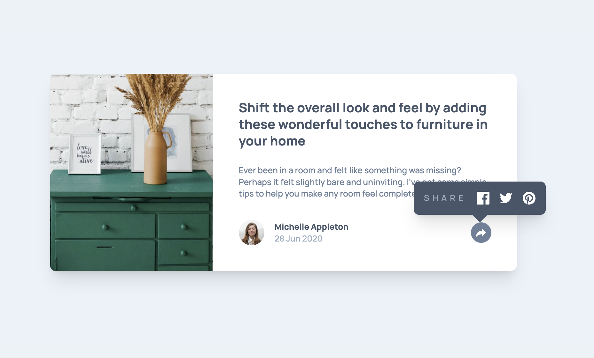
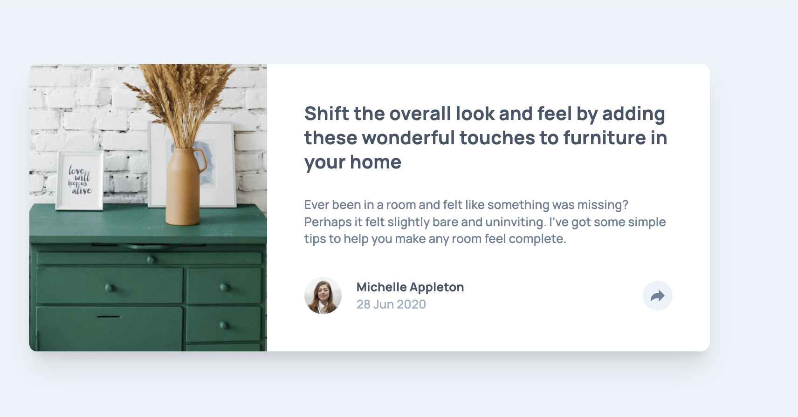
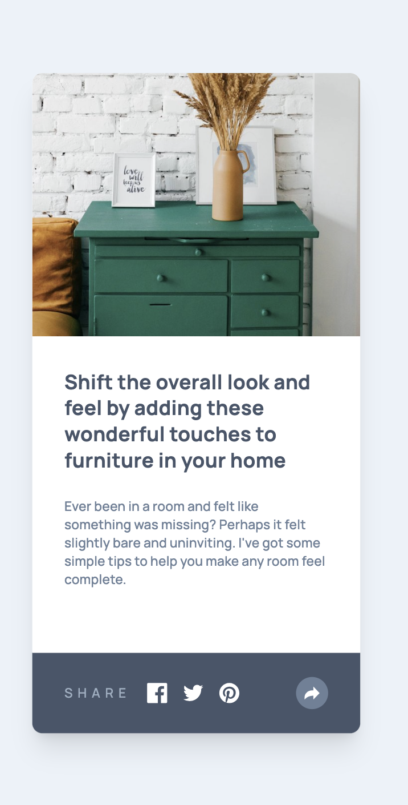
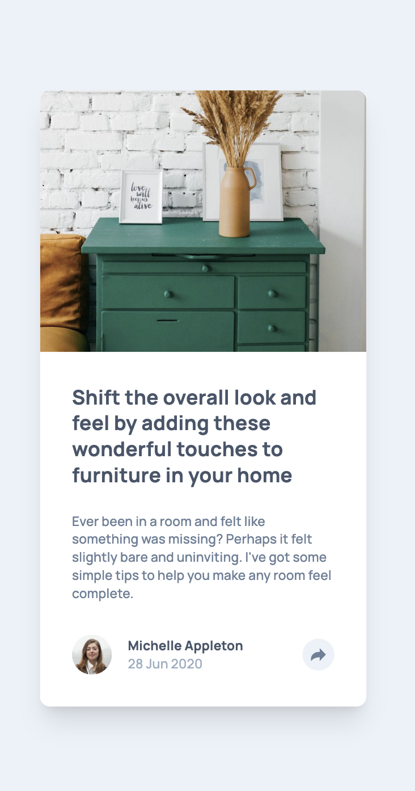
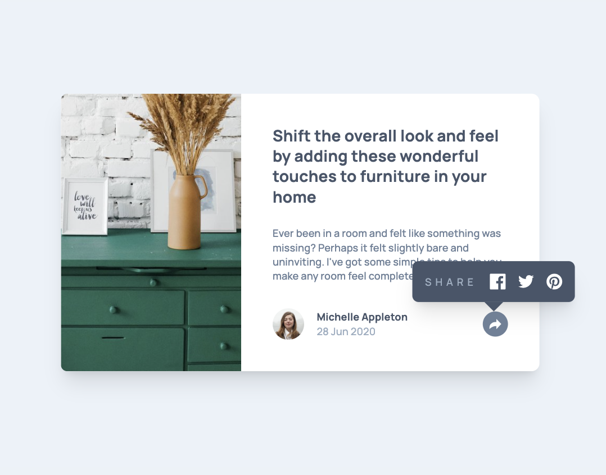
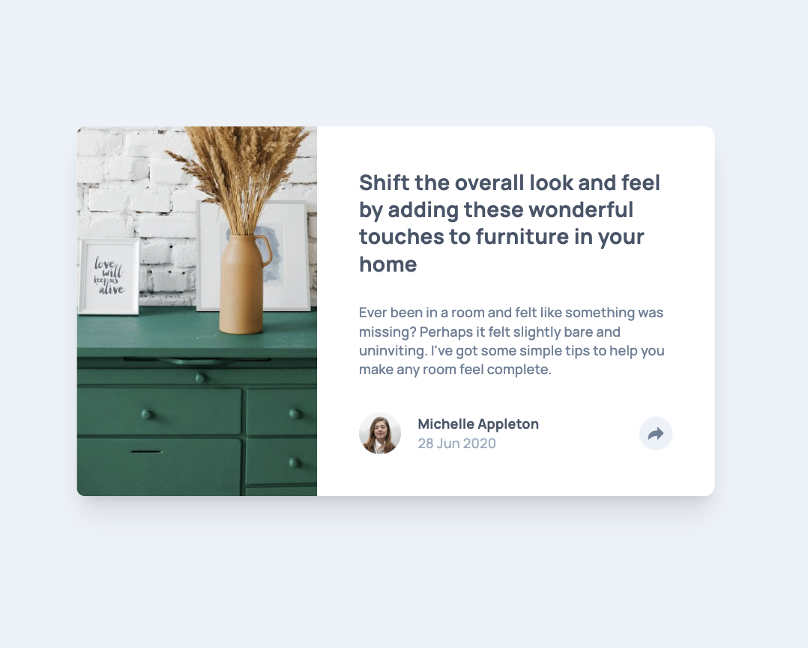

# Frontend Mentor - Article preview component solution

This is a solution to the [Article preview component challenge on Frontend Mentor](https://www.frontendmentor.io/challenges/article-preview-component-dYBN_pYFT). Frontend Mentor challenges help you improve your coding skills by building realistic projects. 

## Table of contents

- [Overview](#overview)
  - [The challenge](#the-challenge)
  - [Screenshot](#screenshot)
  - [Links](#links)
- [My process](#my-process)
  - [Built with](#built-with)
  - [What I learned](#what-i-learned)
  - [Continued development](#continued-development)
  - [Useful resources](#useful-resources)
- [Author](#author)
- [Acknowledgments](#acknowledgments)

## Overview

I built the Article Preview component with a mobile-first approach and then refined it for tablet and desktop. The layout adapts across breakpoints and the share interaction switches between a bottom bar on mobile and a floating tooltip on larger screens. The goal was a clean, accessible, and faithful recreation of the original design.

### The challenge

Users should be able to:

- View the optimal layout for the component depending on their device's screen size
- See the social media share links when they click the share icon

### Screenshot

### Links

- Solution URL: [https://github.com/tabathamor/article-preview](https://github.com/tabathamor/article-preview)
- Live Site URL: [https://article-preview-k2w36sg7o-tabathamors-projects.vercel.app/](https://your-live-site- url.com)

## My process
I started by rereading the requirements and mapping the layout into simple building blocks. Even though I haven’t used vanilla JavaScript in a long time, I decided to implement the share interaction without any frameworks to keep the project lightweight. I built the mobile layout first, added the tablet/desktop breakpoint styles, and then wired the share toggle (including click-away behavior) with a few lines of JS. Finally, I did responsive checks and small accessibility touches (focus, semantics).
### Built with

- Semantic HTML5 markup
- CSS custom properties
- tailwind
- CSS Grid
- Mobile-first workflow

### What I learned

This was mostly a refresher: small components still benefit from a clear mobile-first plan and clean utility classes.

Re-practiced vanilla JS basics: toggling state with classList, adding click-away listeners, and using defer/DOMContentLoaded to avoid null DOM references.

Positioning a floating tooltip reliably: reading button geometry with getBoundingClientRect() and keeping the arrow aligned even near viewport edges.

Tiny but useful details: ensuring responsive spacing remains consistent across breakpoints and preventing style “jumps” when switching from mobile bar to desktop tooltip.

## Author

- Frontend Mentor - [@tabathamor](https://www.frontendmentor.io/profile/tabathamor)
- Github - [@tabathamor](https://github.com/tabathamor)

